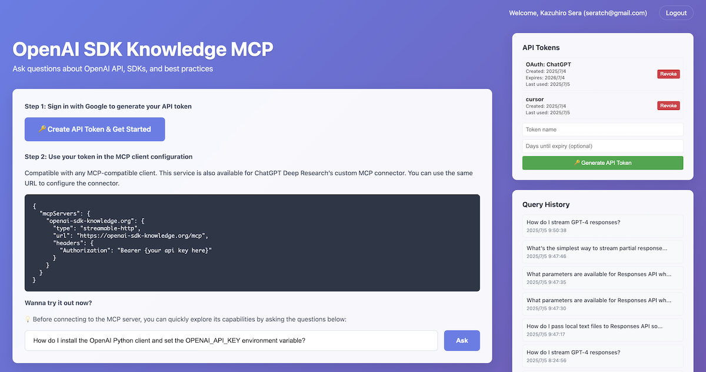
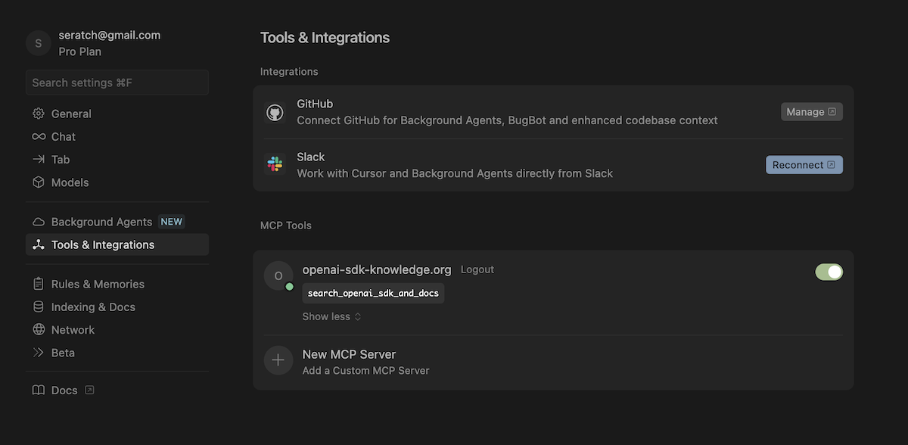
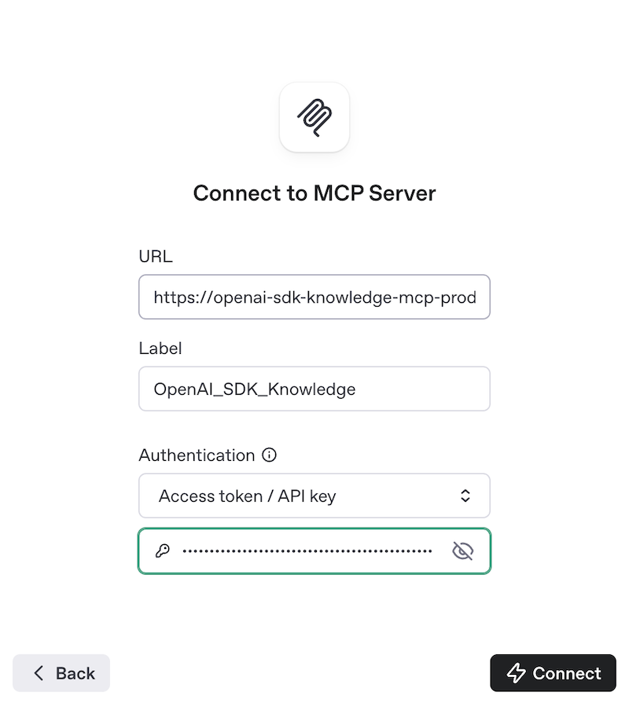
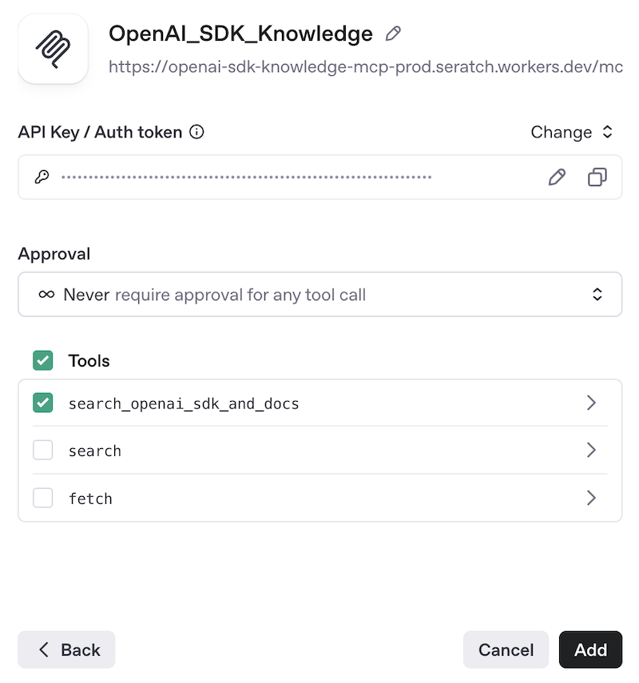
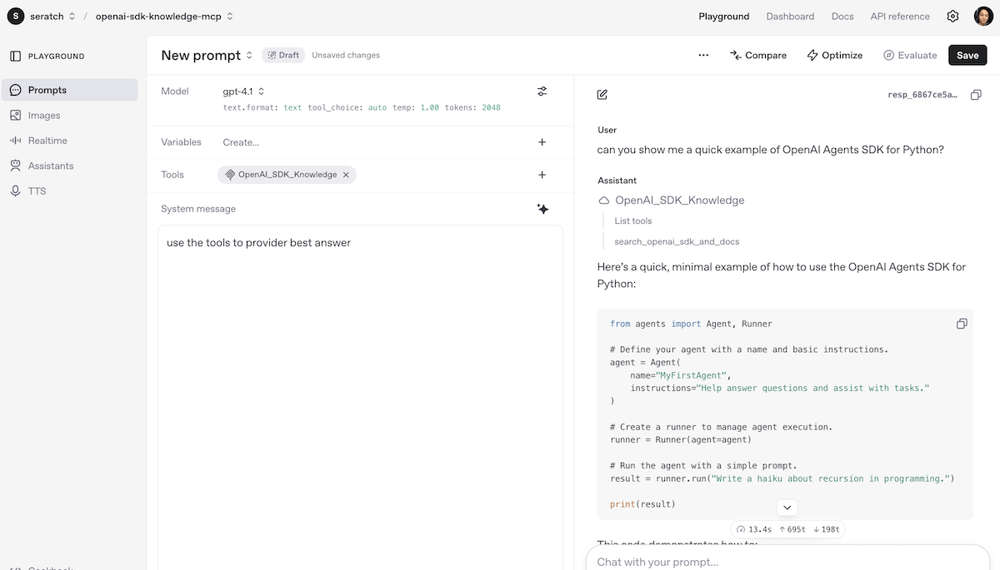
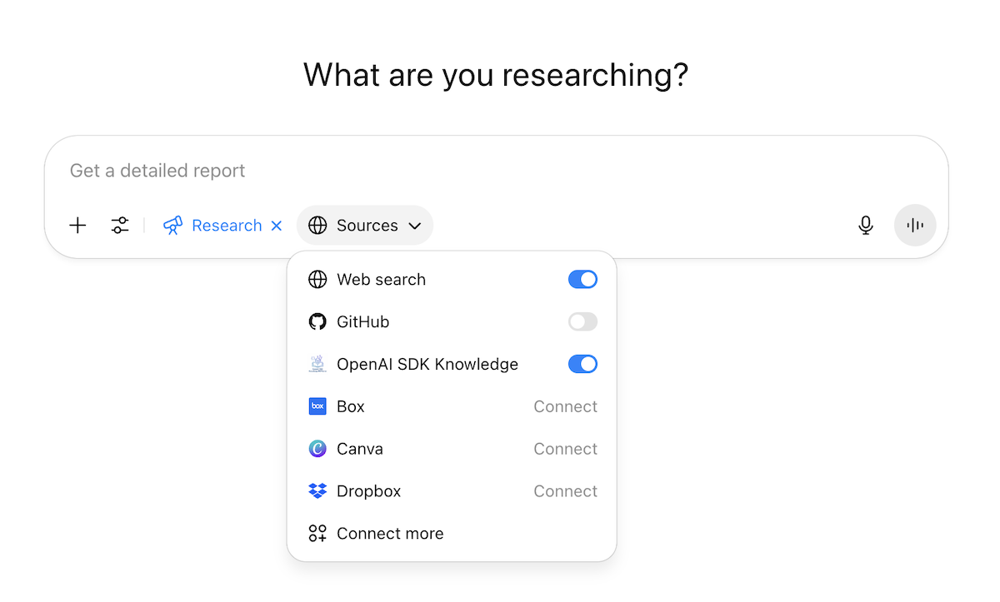
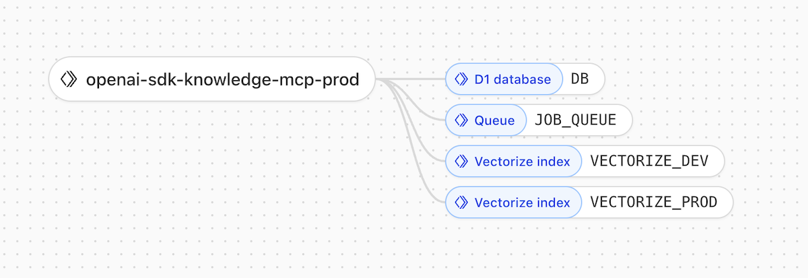

# OpenAI SDK Knowledge MCP Server (unofficial)

[](https://opensource.org/licenses/MIT)
[](https://www.typescriptlang.org/)
[](https://workers.cloudflare.com/)

An MCP server that knows the OpenAI API inside and out. 100% TypeScript built with [OpenAI Agents SDK](https://openai.github.io/openai-agents-js/), [Hono](https://hono.dev), Cloudflare Workers, and [Drizzle ORM](https://orm.drizzle.team/). Powered by RAG and ready to answer your technical questions.



## Developer Highlights

- **Cloudflare stack**: Fully leverages Cloudflare Workers, Queues, D1, Vectorize, and AI Gateway.
- **Streamable HTTP MPC Server**: Compatible with any MPC clients.
- **ChatGPT Deep Research connector**: Meets ChatGPT's Deep Research connector requirements.
- **Always updated**: Continuously fetches OpenAI repos and community forums for new content.
- **Rapidly built with AI**: Developed hand in hand with various AI coding tools.

## Streamable HTTP MCP Server

Use a publicly accessible URL (e.g., ngrok, Cloudflare Tunnel) to serve the endpoints for MCP clients. You can generate the token on the top page:

```json
{
  "mcpServers": {
    "openai-sdk-knowledge.org": {
      "type": "streamable-http",
      "url": "https://openai-sdk-knowledge.org/mcp",
      "headers": {
        "Authorization": "Bearer {your api key here}"
      }
    }
  }
}
```

For example, you can add this MCP server to Cursor:



Not only Cursor—you can use this MCP server with any other tools supporting MCP server connections.

### OpenAI Responses API's Hosted MCP Server Tool

You can pass `https://openai-sdk-knowledge.org/mcp` along with a valid API token:



Then, you can call the tool in the conversation with the Responses API agent:



### ChatGPT Deep Research MCP Connector

Also, for ChatGPT Deep Research customer connector, use the same URL. When the ChatGPT server accesses this app's MCP server endpoint, it returns `search` and `fetch` tools as well (see [the documentation](https://platform.openai.com/docs/mcp) for details).



## Run Locally

```bash
# Clone and install
git clone https://github.com/seratch/openai-sdk-knowledge-org.git
cd openai-sdk-knowledge-org/
npm install

# Configure (add your OpenAI API key)
cp .dev.vars.example .dev.vars
# Edit .dev.vars: OPENAI_API_KEY=sk-your-key-here

# Run it
npm run dev
```

You can access `http://localhost:8787` and see how it works.

**Requirements**: Node.js 22+ and API keys (OpenAI, GitHub)

## Architecture

This app is essentially a simple web app that runs on Cloudflare Workers. The web app provides MCP server protocol compatible endpoints, as well as a web user interface. For the RAG data pipeline, it collects data from sources and generates asynchronous tasks to run and enqueue them into Cloudflare’s Queue.

```
src/
├── agents/          # Internally used agents built with OpenAI Agents SDK
├── pipeline/        # RAG data collection and processing
├── server/mcp/      # MCP protocol implementation
├── server/web/      # Web app implementation
├── storage/         # Vector database (Vectorize) and D1 database access
└── index.ts         # App entry point
```



### Agents

This repository includes several specialized agents built with the OpenAI Agents SDK:

- `main-agent.ts` – orchestrates RAG, web search, and translation capabilities
- `rag-agent.ts` – searches the internal documentation knowledge base
- `web-search-agent.ts` – performs web searches when the RAG agent cannot answer
- `translator-agent.ts` – translates user queries and agent responses

## License

MIT
